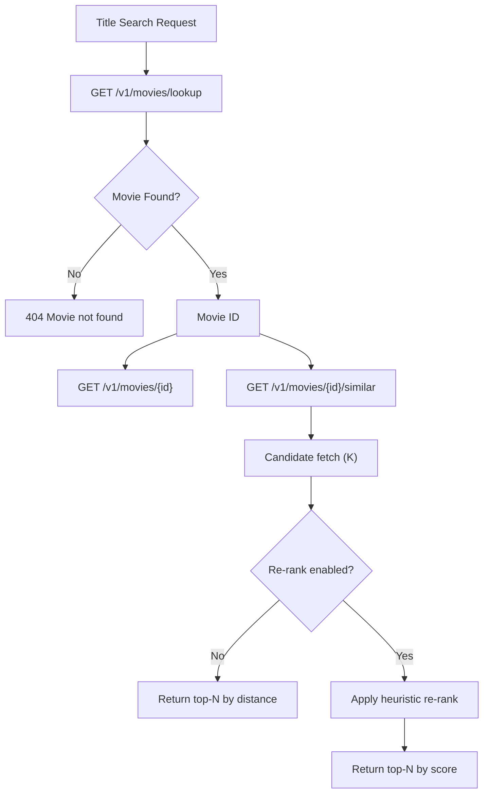
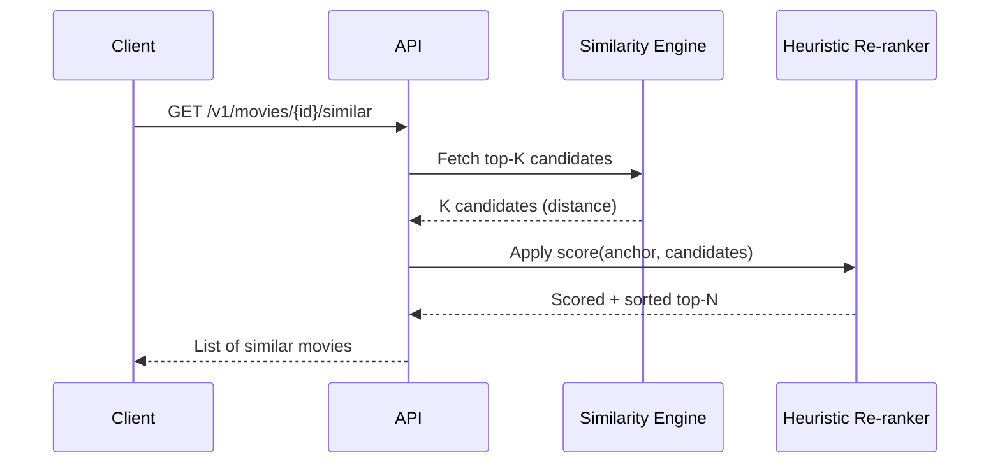
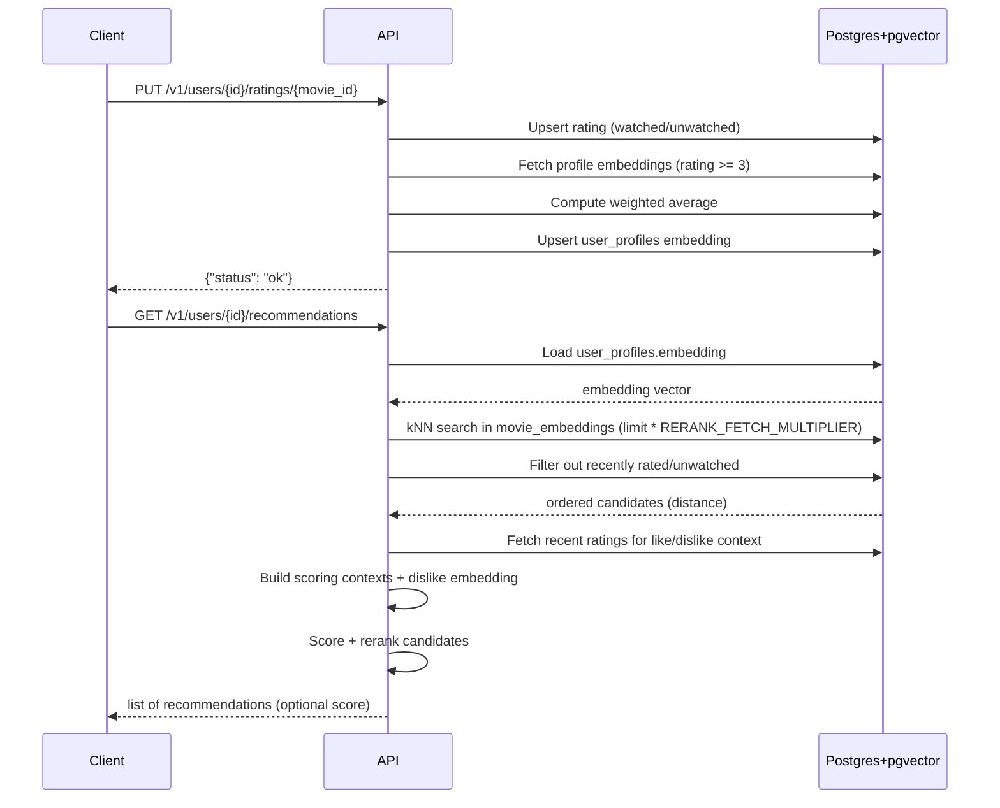
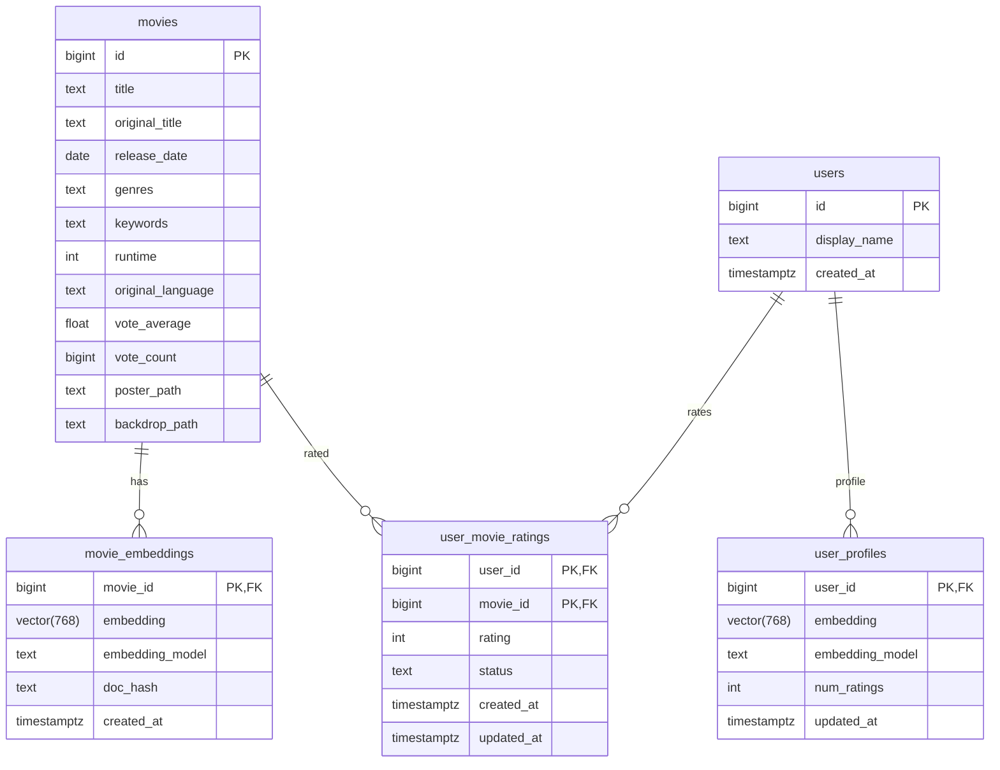

# Taste‑Kid API

FastAPI service powering search, similarity, and personalized recommendations for movies.

## Overview

The API exposes endpoints for:

- Health checks
- Movie lookup and details
- Similar movies by vector distance
- User profile creation
- Ratings and profile recompute
- Rating queue and next-movie suggestions
- Feed and recommendations
- User/movie match scores

Core entrypoint: `apps/api/src/api/main.py`. All routes are mounted under `/v1`.

## Response Envelope + Pagination

All endpoints return a response envelope:

```json
{
  "data": {"...": "..."},
  "meta": {
    "next_cursor": "20",
    "has_more": true
  }
}
```

Pagination is offset-based using `cursor` (offset) and `k` (page size). The API fetches `k + 1` items to decide `has_more`.

## Search + Similarity Flow



## Similarity + Re-ranking

Similarity search uses pgvector cosine distance (`<=>`) on `movie_embeddings.embedding`.
If the anchor movie has no embedding, the API returns `EMBEDDING_NOT_FOUND`.

Re-ranking is a deterministic heuristic (not an ML model). It combines:

- Cosine similarity (distance)
- Genre/style overlap
- Runtime + release-year proximity
- Language match
- Popularity quality via `vote_count`
- Penalty for tonal genre mismatch



### Key settings

- `SIM_CANDIDATES_K`: initial candidate pool size
- `SIM_TOP_N`: final number returned
- `SIM_RERANK_ENABLED`: enable re-ranking

## Recommendations + Feed

- **Recommendations**: two-stage flow—vector retrieval against the user profile embedding, then dislike-aware heuristic reranking (returns optional `score`).
- **Feed**: uses recommendations when a profile exists; otherwise falls back to the popularity-based queue (`score` is `null`).

### User Embedding + Rating Effects

Ratings update the user profile embedding immediately.

- **Profile input**: `status = watched` with `rating >= 3`.
- **Profile weighting**: rating 5 → `1.0`, 4 → `0.8`, 3 → `NEUTRAL_RATING_WEIGHT` (default `0.2`).
- **Dislike input**: ratings `<= 2` build a separate dislike embedding/context used only for reranking.
- **Rerank penalty**: when at least `DISLIKE_MIN_COUNT` dislikes exist, candidates use `score = like_score - DISLIKE_WEIGHT * dislike_score`.
- **Aggregation**: weighted average of profile embeddings = user profile vector; empty profiles delete the row.

Changing a rating from `>= 3` to `< 3`, or marking a movie as `unwatched`, removes it from the profile on the next recompute.

#### Worked Example (Weighted Average)

Assume 3 watched movies with 3‑dim embeddings (toy example for intuition):

- Movie A embedding = `[0.2, 0.6, 0.0]`, rating = 5 → weight = `1.0`
- Movie B embedding = `[0.4, 0.4, 0.2]`, rating = 4 → weight = `0.8`
- Movie C embedding = `[0.9, 0.1, 0.0]`, rating = 3 → weight = `0.2` (neutral)

Weighted sum = `1.0*[0.2, 0.6, 0.0] + 0.8*[0.4, 0.4, 0.2] + 0.2*[0.9, 0.1, 0.0]`
= `[0.2 + 0.32 + 0.18, 0.6 + 0.32 + 0.02, 0.0 + 0.16 + 0.0]`
= `[0.7, 0.94, 0.16]`

Total weight = `1.0 + 0.8 + 0.2 = 2.0`

User profile embedding = `[0.7/2.0, 0.94/2.0, 0.16/2.0]`
= `[0.35, 0.47, 0.08]`

That profile vector is then used for kNN search against `movie_embeddings`. Ratings `<= 2` are excluded from the profile and used only for dislike-aware reranking.

### Recommendation Flow



### Recommendation tuning settings

- `DISLIKE_WEIGHT`: penalty strength applied to dislike scores.
- `DISLIKE_MIN_COUNT`: minimum disliked ratings required before applying dislike rerank.
- `NEUTRAL_RATING_WEIGHT`: weight for 3★ ratings in the profile (default `0.2`).
- `SCORING_CONTEXT_LIMIT`: number of recent ratings used to build contexts.
- `RERANK_FETCH_MULTIPLIER`: candidate expansion factor for reranking.
- `MAX_FETCH_CANDIDATES`: cap on total fetched candidates after expansion.
- `MAX_SCORING_GENRES`: number of genres kept in scoring context.
- `MAX_SCORING_KEYWORDS`: number of keywords kept in scoring context.

## Endpoints (All Under `/v1`)

### Health

- `GET /health`

### Movies

- `GET /movies/lookup?title=...`
- `GET /movies/{movie_id}`
- `GET /movies/{movie_id}/similar?k=20&cursor=0`

### Users + Ratings

- `POST /users` (create user)
- `GET /users/{user_id}` (summary)
- `PUT /users/{user_id}/ratings/{movie_id}` (rate or set status)
- `POST /users/{user_id}/rate` (rate with body)
- `GET /users/{user_id}/ratings` (rated movies)
- `GET /users/{user_id}/rating-queue` (popularity-based queue)
- `GET /users/{user_id}/next` (next movie to rate)
- `GET /users/{user_id}/profile` (profile stats)
- `GET /users/{user_id}/recommendations`
- `GET /users/{user_id}/feed`
- `GET /users/{user_id}/movies/{movie_id}/match` (0–100 match score)

## Data Model



## ML/MLP Concepts (Grounded in This Service)

- **Embeddings**: Movies have precomputed vectors stored in `movie_embeddings`.
- **Similarity**: Uses cosine distance via pgvector. Smaller distance = more similar.
- **User profile**: Weighted average of liked movie embeddings (a centroid in embedding space).
- **Recommendations**: Nearest neighbors to the user centroid, excluding seen items.
- **Re-ranking**: Heuristic scoring on top of similarity; no learned model in API.
- **If you add an MLP**: Replace the heuristic with a trained scoring model that consumes engineered features or embeddings and outputs a relevance score.

## Local Development

Run the full stack via Docker Compose at repo root:

```bash
make build
```

API docs: http://localhost:8000/docs
