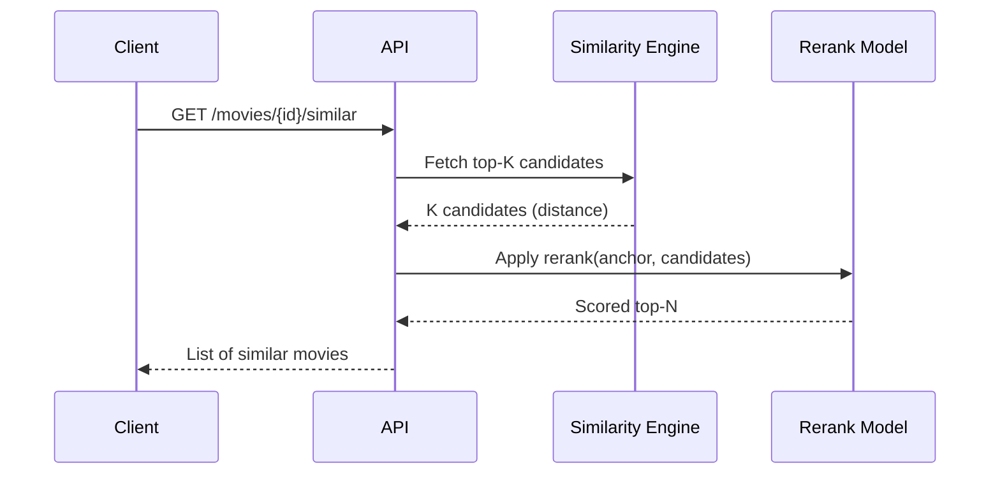

# Taste‑Kid API

FastAPI service powering search, similarity, and personalized recommendations.

## Overview

The API exposes endpoints for:

- Movie lookup and details
- Similar movies by vector distance
- User profile creation
- Ratings and profile recompute
- Feed and recommendations

Core entrypoint: `apps/api/src/api/main.py`.

## Search + Similarity Flow


## Re-ranking

Re-ranking improves candidate ordering after the initial vector similarity pass.



### Key settings

- `SIM_CANDIDATES_K`: initial candidate pool size
- `SIM_TOP_N`: final number returned
- `SIM_RERANK_ENABLED`: enable re-ranking

## Recommendations + Feed

- **Recommendations**: top‑N by similarity to user profile embedding.
- **Feed**: if user has a profile, same as recommendations; otherwise falls back to popularity‑based queue.

## Local Development

Run the full stack via Docker Compose at repo root:

```bash
make build
```

API docs: http://localhost:8000/docs
