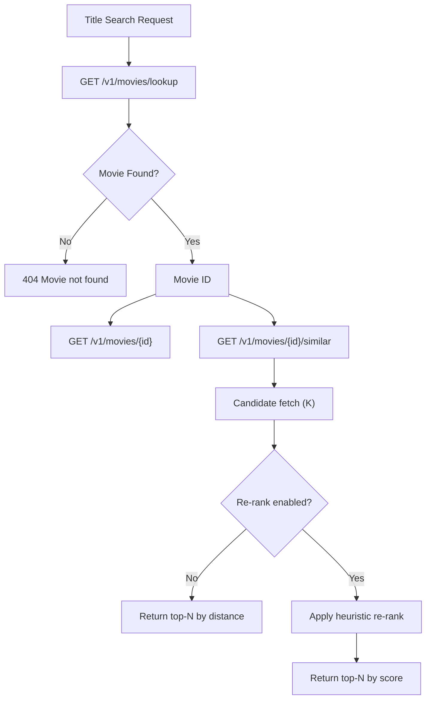

# Taste-Kid API

FastAPI service powering search, similarity, and personalized recommendations for movies.

## Overview

The API exposes endpoints for:

- Health checks
- Movie lookup and details
- Similar movies by vector distance
- User profile creation
- Ratings and profile recompute
- Rating queue and next-movie suggestions
- Feed and recommendations
- User/movie match scores

Core entrypoint: `apps/api/src/api/main.py`. All routes are mounted under `/v1`.

## Authentication (Keycloak / OIDC)

When Keycloak is enabled, the API expects RS256 access tokens and validates them via JWKS.

- **Verification**: The API fetches signing keys from `KEYCLOAK_JWKS_URL` and verifies RS256 signatures.
- **Issuer**: The token `iss` must match `KEYCLOAK_ISSUER_URL`.
- **Audience**: Keycloak access tokens may use `azp` instead of `aud`; the API accepts either `aud` or `azp` matching `KEYCLOAK_AUDIENCE`.
- **User mapping**: The API maps OIDC `sub` to an internal `users.id` via `user_identities`.

Behavior changes when Keycloak is enabled:

- `/v1/auth/login` returns `410 Gone` (login is handled by the identity provider)
- `/v1/auth/register` returns `410 Gone` (registration is handled by the identity provider)

### URL Topology (Development)

Keycloak is reachable in two different ways:

- Browser/web app uses the public issuer: `http://localhost:8080/realms/taste-kid`
- API container fetches JWKS from: `http://keycloak:8080/realms/taste-kid/protocol/openid-connect/certs`

This split is required because `localhost` inside a container is not the host machine.

## Database Bootstrap

- `infra/db/init.sql` is used when a Postgres volume is created for the first time.
- The API also runs idempotent startup DDL to ensure required tables exist (for example `user_identities`).
  This is designed to be safe for existing dev databases and does not wipe data.

## Response Envelope + Pagination

All endpoints return a response envelope:

```json
{
  "data": {"...": "..."},
  "meta": {
    "next_cursor": "20",
    "has_more": true
  }
}
```

Pagination is offset-based using `cursor` (offset) and `k` (page size). The API fetches `k + 1` items to decide `has_more`.

## Search + Similarity Flow



## Similarity + Re-ranking

Similarity search uses pgvector cosine distance (`<=>`) on `movie_embeddings.embedding`.
If the anchor movie has no embedding, the API returns `EMBEDDING_NOT_FOUND`.

Re-ranking is a deterministic heuristic (not an ML model). It combines:

- Cosine similarity (distance)
- Genre/style overlap
- Runtime + release-year proximity
- Language match
- Popularity quality via `vote_count`
- Penalty for tonal genre mismatch

## Endpoints (All Under `/v1`)

### Health

- `GET /health`

### Movies

- `GET /movies/lookup?title=...`
- `GET /movies/{movie_id}`
- `GET /movies/{movie_id}/similar?k=20&cursor=0`

### Users + Ratings

- `POST /users` (create user)
- `GET /users/{user_id}` (summary)
- `PUT /users/{user_id}/ratings/{movie_id}` (rate or set status)
- `POST /users/{user_id}/rate` (rate with body)
- `GET /users/{user_id}/ratings` (rated movies)
- `GET /users/{user_id}/rating-queue` (popularity-based queue)
- `GET /users/{user_id}/next` (next movie to rate)
- `GET /users/{user_id}/profile` (profile stats)
- `GET /users/{user_id}/recommendations`
- `GET /users/{user_id}/feed`
- `GET /users/{user_id}/movies/{movie_id}/match` (0-100 match score)
